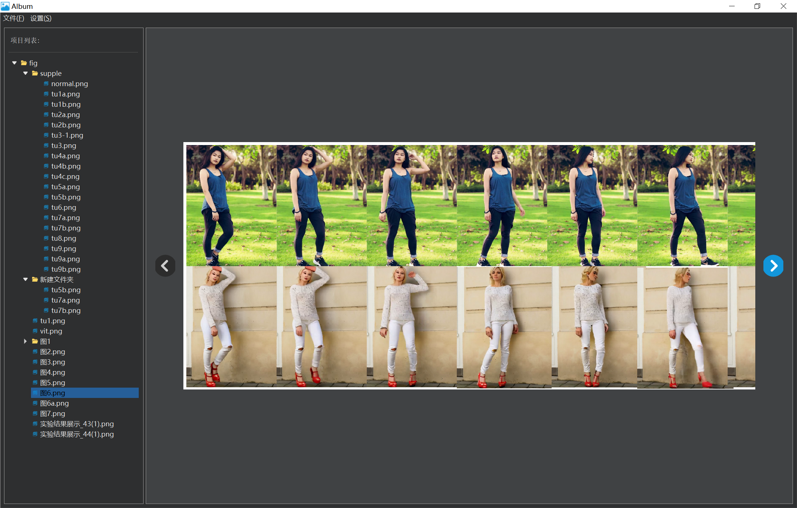

# QT-Album

## 项目功能

本项目是基于 Qt 框架开发的简易相册管理工具，主要实现以下功能：

- 🖼️ **图片浏览与展示**
  支持本地图片加载、缩略图预览、大图查看等功能。

- 📁 **相册管理**
  可创建、切换不同相册分类，对图片进行归类整理。

- ✏️ **基础图片操作**
  实现图片的添加、删除、重命名等基本管理操作。

- 🎨 **界面交互优化**
  采用友好的图形界面，支持鼠标点击、切换、缩放等流畅交互。

- 📝 **信息记录**
  可对图片添加简单备注或描述信息。

